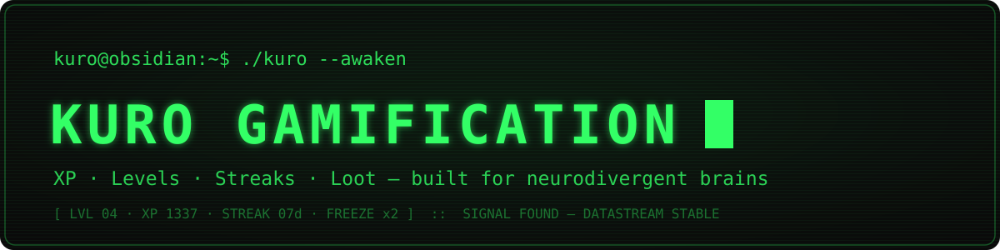

# Kuro Gamification

> [🇬🇧 English](README.md) · 🇩🇪 Deutsch

**Neurodivergenz-taugliche Gamification für Obsidian — XP, Level, Streaks mit Freeze-Tokens, deterministische Loot-Drops und optionale Lore, off-by-default für alles, was eskalieren könnte.**

[](LICENSE)
[](LICENSE-DOCS)
[](https://git.jkaindl.de/jkaindl/kuro-gamification/releases)


Deine Daily-Notes halten längst fest, was du getan hast — dieses Plugin liest sie und macht daraus XP, Level und einen Streak, der einen verpassten Tag übersteht. Alles läuft in deinem Vault: kein Account, kein Server, kein Netzwerkzugriff, und nichts nervt dich, solange du es nicht selbst einschaltest.



## Features

- **XP aus deinen Daily-Notes** — 2 XP pro abgehakter Checkbox + Tagesabschluss-Boni (50/75/90 %)
- **User-definierte Habits** — Frontmatter-Toggles `qigong: true` etc., XP pro Habit konfigurierbar
- **Weekly Review/Planning** — 50/30 XP für `review_done` / `planung_done` im Weekly-Frontmatter
- **Streaks mit Freeze-Tokens** — 2 freie Skip-Tage pro Monat (konfigurierbar). Streak-Bonus ab Tag 3/7/14/30
- **10 Level** — `SIGNAL LOST` → `K U R O`, alle Titel + Schwellen in Settings editierbar
- **Deterministische Loot-Drops** — 1 Drop pro Level über 1, 5 Tiers (Common → Mythic), 50+ Default-Belohnungen. Custom-Pool unterstützt
- **Lore-Reveal** — 10 narrative Fragmente, eines pro Level. Standardmäßig ruhige Klartext-Lore; fertige **Gothic-Cyberpunk**- und **Cozy**-Packs liegen im `packs/`-Ordner des Repos, oder importier dein eigenes
- **Sidebar-Status-Widget** + **Status-Codeblock** (`` ```kuro-status `` in jeder Note einbetten)
- **„XP manuell anpassen…"** — Befehl für Offline-Aktivitäten, Geschenke, Korrekturen
- **Export / Import / Reset** — volle Daten-Portabilität via JSON, plus Loot/Lore-**Pack**-Import/-Export
- **Zweisprachig** — Deutsch und Englisch; folgt beim ersten Start deiner Obsidian-UI-Sprache

## Warum dieses Plugin?

Die meisten Gamification-Plugins für Note-Apps sind für neurotypische Gehirne gebaut: harte Streaks, die dich für einen verpassten Tag bestrafen, exponentielle XP-Kurven, die Konsistenz statt echtes Leben belohnen, Push-Notifications, die nerven. Dieses Plugin ist für ADHS und Autismus:

- **Freeze-Tokens absorbieren Lücken.** Ein verpasster Tag bricht den Streak nicht.
- **Linear-quadratische XP-Kurve.** Kein exponentieller Spike, der Fortschritt hinter Wochenend-Marathons sperrt.
- **Transparente Berechnung.** Optionale Verbose-Aufschlüsselung zeigt genau, *warum* welches XP entstand.
- **Jedes eskalierende Feature off-by-default.** Keine Status-Bar-Nervpolizei, kein Toast-Spam, kein Audio.
- **Features einzeln pausierbar.** XP aus Checkboxen? Aus. Streaks? Aus. Lore? Aus. Alle unabhängig.
- **Deterministische Loot-Auswahl.** Dieselben Optionen bleiben sichtbar, bis du eine einlöst. Kein „Neu laden für bessere Optionen"-Pattern.

## Voraussetzungen

- **Obsidian ≥ 1.8.7**, Desktop oder Mobile (`isDesktopOnly: false`).
- Keine externen Dienste, Accounts oder Netzwerkzugriff — die gesamte XP-/Streak-/Loot-/Lore-Logik läuft lokal gegen deine Daily-Notes.
- Keine Runtime-Abhängigkeiten.

## Installation

### Community-Plugins

**Einstellungen → Community-Plugins → Durchsuchen** öffnen, nach **Kuro Gamification** suchen, dann **Installieren** und **Aktivieren**.

### Manuell

1. `main.js`, `manifest.json`, `styles.css` aus dem [letzten Release](https://git.jkaindl.de/jkaindl/kuro-gamification/releases) laden und nach `<vault>/.obsidian/plugins/kuro-gamification/` kopieren
2. Einstellungen → Community-Plugins → Plugins neu laden
3. Einstellungen → Community-Plugins → Kuro Gamification → aktivieren

### Aus dem Quellcode

```bash
git clone https://git.jkaindl.de/jkaindl/kuro-gamification
cd kuro-gamification && npm install && npm run build
# main.js manifest.json styles.css → <vault>/.obsidian/plugins/kuro-gamification/
```

Optional danach das CRT-Phosphor-CSS-Snippet einrichten — siehe [Ästhetik-CSS](#ästhetik-css) unten.

## Verwendung

### Schnellstart (3 Klicks)

1. Öffne die **Kuro Status**-Sidebar via Ribbon-Icon (Terminal) oder über die Befehlspalette → „Status-Sidebar öffnen"
2. Hake eine Checkbox in deiner Daily-Note ab → Sidebar refresht binnen ~1 Sekunde
3. Sobald du Level 2 erreichst (200 XP), klick **🎲 Loot einlösen** für deine erste Belohnung

### Im laufenden Betrieb

- Abgehakte Checkboxen in deiner Daily-Note geben automatisch XP beim Speichern — kein manuelles Loggen nötig.
- Eigene Habits (Frontmatter-Toggles wie `qigong: true`) unter Einstellungen → Habits hinzufügen, jeweils mit eigenem XP-Wert.
- `review_done: true` / `planung_done: true` im Frontmatter einer Weekly-Note für den Weekly-Review/Planning-Bonus setzen.
- Einen `kuro-status`-Codeblock (siehe [Status-Codeblock](#status-codeblock) unten) in jede Note einbetten für eine Live-Statusansicht ohne Sidebar.
- Einen Tag verpasst? Ein Freeze-Token fängt das automatisch ab — keine Aktion nötig, kein Streak-Verlust.
- Den Befehl **„XP manuell anpassen…"** für Offline-Aktivitäten, Korrekturen oder Geschenke nutzen.

## Konfiguration

| Sektion | Was sie steuert |
|---|---|
| 🎮 Allgemein | Sprache (DE/EN), Reduce-Animations, Statusleisten-Item, Aktions-Hinweise, Verbose-Aufschlüsselung, Sidebar an/aus |
| 📁 Pfade | Daily-/Weekly-Ordnerpfade + Datumsformate |
| ⚡ XP-Quellen | XP pro Checkbox, Abschluss-Boni, Pomodoro-Key/Schwelle/Bonus |
| 🎯 Habits | Eigene Habit-Liste hinzufügen/bearbeiten/entfernen (Frontmatter-Key + Label + XP) |
| 📅 Weekly | Review-/Planning-Frontmatter-Keys + XP |
| 🔥 Streaks | Tagesqualifikations-Schwelle, monatliche Freeze-Tokens |
| 📊 Level & Loot | Loot an/aus, Optionen pro Drop |
| 📜 Lore | Lore-Reveal an/aus |
| 📚 Packs | Loot-/Lore-Packs installieren/wechseln/löschen; pro Einheit export/kopieren/auf Werkszustand zurücksetzen |
| 🛠 Erweitert | Log-Level; kompletter State-Export/-Import/-Reset (inkl. XP) |
| ℹ️ Über | Version, Link zur In-Vault-Doku |

### Status-Codeblock

Status überall einbetten:

````markdown
```kuro-status
mode: full          # full | compact | minimal
loot: show          # show | hide
lore: show          # show | hide
breakdown: hide     # show | hide
```
````

### Empfohlenes Habit-Setup (ADHS-tauglich)

Im Daily-Frontmatter:

```yaml
qigong: true
peloton: false
draussen: true
haushalt: false
pomodoros: 4
```

In Einstellungen → Habits hinzufügen:
- `qigong` → `🧘 Qi Gong` → 10 XP
- `peloton` → `🚴 Peloton` → 15 XP
- `draussen` → `🌳 Draußen` → 10 XP
- `haushalt` → `🏠 Haushalt` → 10 XP

Pomodoro-Bonus: automatisch wenn `pomodoros >= threshold` (Default ≥ 4 → +10 XP).

### Ästhetik-CSS

Das Plugin funktioniert ohne externes Styling — es bringt sinnvolles Struktur-CSS mit. Für die volle **Gothic-Cyberpunk-CRT-Terminal-Optik** (Phosphor-Grün, Scanlines, Flicker) liefert [Ästhetik-CSS](docs/aesthetic-css.de.md) · ([EN](docs/aesthetic-css.en.md)) das CSS samt Einbau-Anleitung (bewusst als Doku gehalten, nicht als getrackte `.css`-Datei — so wird es nicht gebündelt und taucht im CSS-Lint des Plugin-Quellcodes nie auf).

Das Snippet stylt `pre.kuro-status`, `pre.kuro-loot` und die Callouts `[!kuro]`, `[!levelup]`, `[!spoiler]`, `[!streak]`. Es hat keine harte Abhängigkeit zum Kuro-Theme (läuft unter jedem Theme, das CSS-Custom-Properties respektiert).

## Funktionsweise

Das Plugin beobachtet `vault.modify`-Events (800 ms debounced) auf deinen Daily-/Weekly-Notes. Bei jedem Trigger liest es die relevanten Notes (Checkboxen und Frontmatter) neu ein, und pure-function Engines berechnen das Ergebnis komplett neu — XP-Summe, Level, Streak-Status und (bei neuem Level) einen deterministischen Loot-Drop:

- **`XpEngine`** summiert XP aus abgehakten Checkboxen, Abschluss-Prozent-Boni, konfigurierten Habits und dem Weekly-Review/Planning-Bonus, und leitet daraus über die linear-quadratische XP-Kurve das Level ab.
- **`StreakEngine`** prüft, ob „heute" die Tagesqualifikations-Schwelle erreicht hat, verbraucht bei einem verpassten Tag ein Freeze-Token statt zurückzusetzen, und wendet Streak-Tier-Boni an (Tag 3/7/14/30).
- **`LootEngine`** wählt pro Level-up über 1 eine deterministische Belohnung (geseedet aus Level + Save-Zähler, sodass sich ein Drop beim Neuladen nicht ändert) aus einem 5-Tier-Pool, der über **Packs** ersetzbar ist.
- **`LoreEngine`** enthüllt das Narrativ-Fragment zum neuen Level, aus dem jeweils aktiven Lore-Pack.

Die Engines tragen keine Obsidian-Imports und laufen deshalb in reinem Node unter jest — die UI-Schicht (Sidebar, Status-Codeblock, Modals, Settings-Tab) ist eine dünne Schicht über diesen puren Berechnungen und der Obsidian-API. Daten werden über Obsidians Plugin-Daten-API in `data.json` persistiert; Export/Import/Reset unter Einstellungen → Erweitert arbeiten auf demselben JSON. Modul-Layout und die architektonischen Regeln dahinter stehen in [`AGENTS.md`](AGENTS.md).

## Dokumentation

- [Erste Schritte](docs/getting-started.de.md) · ([EN](docs/getting-started.en.md))
- [Handbuch](docs/manual.de.md) · ([EN](docs/manual.en.md))
- [Anpassung — Loot/Lore-Packs & LLM-Prompts](docs/customization.de.md) · ([EN](docs/customization.en.md))
- [Design-Philosophie](docs/philosophy.de.md) · ([EN](docs/philosophy.en.md))

## Mitwirken

Issues und Pull-Requests laufen über [Forgejo](https://git.jkaindl.de/jkaindl/kuro-gamification) (das GitHub-Repo ist ein Mirror). Entwickelt wird testgetrieben — `npm test` muss grün bleiben, und neue Regeln gehören in die Engines. Siehe [`CONTRIBUTING.md`](CONTRIBUTING.md) und [`AGENTS.md`](AGENTS.md); Beiträge werden unter dem [CLA](CLA.md) angenommen.

## Credits

- Design-Idee von Jay (`v6t2b9`), 2026-03 bis 2026-04
- Als Plugin kodifiziert 2026-04

## Lizenz

Code: **AGPL-3.0-or-later** — siehe [`LICENSE`](LICENSE).
Dokumentation: **CC BY-SA 4.0** — siehe [`LICENSE-DOCS`](LICENSE-DOCS).

Für AGPL-inkompatible Nutzung gibt es eine kommerzielle Lizenz-Option — siehe [`LICENSING.md`](LICENSING.md).

Copyright © 2026 Johannes Kaindl.
